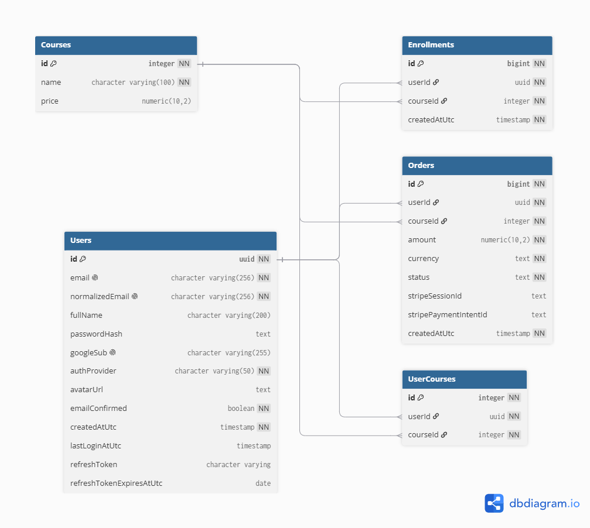

# Opis projektu

## Opis
Aplikacja full-stack oparta o Angular na froncie i ASP.NET Core na backendzie, rozwijana jako serwis webowy z uwierzytelnianiem JWT, z obsługą bazy danych przez Entity Framework. Projekt jest wdrażany na Renderze, a backend działa jako usługa Docker Web Service

## Stos technologiczny
### Frontend
- Angular CLI 
- TypeScript 

### Backend
- ASP.NET Core Web API 
- Entity Framework Core 
- Docker do deploymentu backendu na Render

### Baza danych
- PostgreSQL na Render

### Uruchomienie lokalne
1. Przejdź do katalogu repozytorium, w którym znajduje się Dockerfile.
2. Zbuduj obraz:

```bash
docker build -t codecodex-backend -f ./CodeCodexBackend/CodeCodexBackend/Dockerfile .
```

3. Uruchom kontener:

```bash
docker run -d --name codecodex-backend -p 8080:8080 codecodex-backend
```

4. Aplikacja ma skonfigurowany endpoint health check, można sprawdzić jej stan przez endpoint `/health`.

### Uruchomienie na Render
1. Utwórz nową usługę typu **Web Service** na Renderze
2. Wybierz repozytorium GitHub z projektem 
3. Ustaw:
   - **Language**: `Docker` 
   - **Dockerfile Path**: `./CodeCodexBackend/CodeCodexBackend/Dockerfile` 
   - **Root Directory**: puste 
4. Dodaj wymagane zmienne środowiskowe, w tym connection string do wewnętrznej bazy Render Postgres 
5. Wdróż usługę i sprawdź logi builda na Renderze

## Schemat bazy danych



## Wersja live

- Frontend: https://code-codex-projekt.vercel.app/home
- Backend / API: https://codecodexprojekt.onrender.com

## Uwagi

Projekt udostępnia interaktywną dokumentację API przy użyciu **Swagger UI**.Po uruchomieniu backendu dokumentacja jest dostępna pod adresem:

```text
https://codecodexprojekt.onrender.com/swagger
```

Aby móc wpisać token JWT w autoryzacji, należy wywołać jeden z endpointów: /login /register i wkleić w pole Value: `Bearer <token>`

Sprawdzenie stanu zdrowia backendu: 
```text
https://codecodexprojekt.onrender.com/health
```
